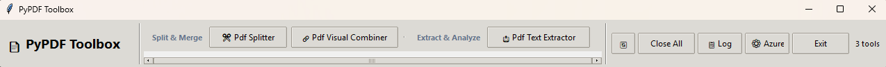
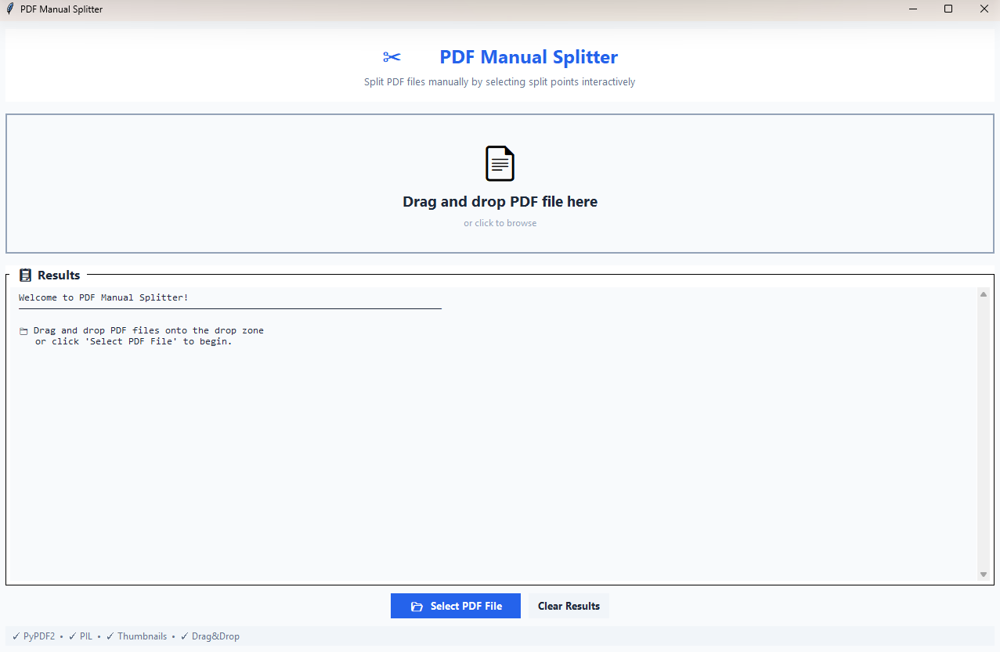
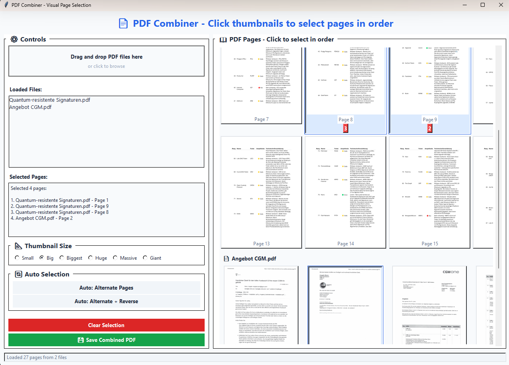
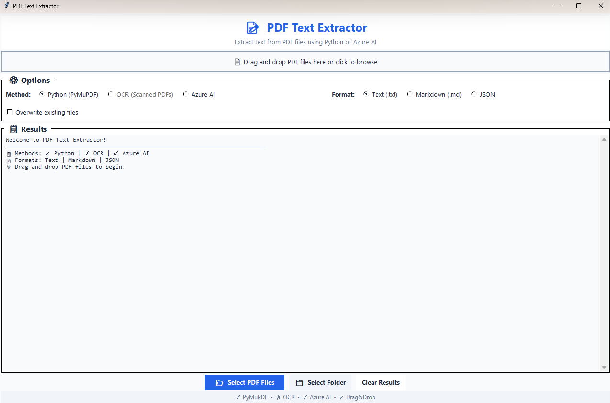
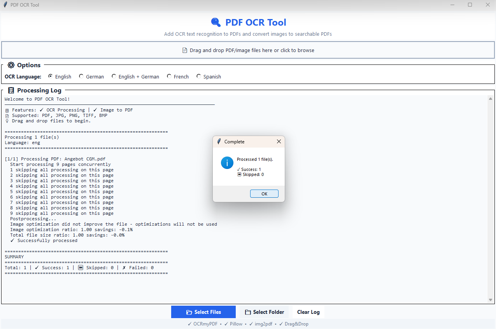

# PyPDF Toolbox GUI

A collection of Python-based PDF utility tools with a unified graphical launcher interface.



*Main launcher bar showing tool categories, available tools, and control buttons*

## Features

- **Slim Launcher Bar**: A compact, always-on-top toolbar that stays at the top of your screen
- **Individual Tool Windows**: Each PDF tool opens in its own window positioned below the launcher
- **Global Azure AI Configuration**: Configure Azure AI services once in the launcher, all tools use the same settings
- **Cross-Platform**: Works on Windows, macOS, and Linux
- **Virtual Environment**: Automatically creates and manages a Python virtual environment
- **Easy Extension**: Add new tools by simply creating `launch_*.bat`/`launch_*.sh` scripts

## Available Tools

### Implemented Tools

<div align="center">

| | | |
|---|---|---|
| [](doc/pdf-splitter/) | [](doc/pdf-combiner/) | [](doc/text-extractor/) |
| **PDF Splitter**<br/>Manually split PDFs by selecting split points with visual thumbnail preview | **PDF Visual Combiner**<br/>Combine multiple PDFs by visually selecting individual pages from thumbnails | **PDF Text Extractor**<br/>Extract text from PDFs using Python, OCR, or Azure AI |
| [`launch_pdf_splitter`](doc/pdf-splitter/) | [`launch_pdf_visual_combiner`](doc/pdf-combiner/) | [`launch_pdf_text_extractor`](doc/text-extractor/) |
| | | |
| [](doc/pdf-ocr/) | [](doc/md-converter/) | |
| **PDF OCR**<br/>Add OCR text recognition to PDFs and convert images to searchable PDFs | **Markdown Converter**<br/>Convert Markdown to PDF/DOCX with live HTML preview and style presets | |
| [`launch_pdf_ocr`](doc/pdf-ocr/) | [`launch_pdf_md_converter`](doc/md-converter/) | |

</div>

**Features:**
- **PDF Splitter**: Visual thumbnail preview, drag & drop support, custom page ranges
- **PDF Visual Combiner**: Configurable thumbnail sizes, auto-selection patterns, multiple PDF support
- **PDF Text Extractor**: Multiple extraction methods (Python, OCR, Azure AI), multiple output formats (Text, Markdown, JSON)
- **PDF OCR**: Add searchable text layer to PDFs, convert images to searchable PDFs, support for multiple languages
- **Markdown Converter**: Convert Markdown to PDF/DOCX with live HTML preview, 6 style presets, and multiple export options

### Planned Tools

- **Split PDF**: Split a PDF into individual pages or page ranges
- **Merge PDF**: Combine multiple PDFs into one document
- **Reorder Pages**: Rearrange pages within a PDF
- **Compress**: Reduce PDF file size
- **Rotate**: Rotate pages within a PDF
- **Extract Pages**: Extract specific pages from a PDF
- **Convert**: Convert between PDF and other formats
- **Watermark**: Add watermarks to PDF documents
- **Encrypt/Decrypt**: Add or remove password protection
- **Metadata**: View and edit PDF metadata

## Quick Start

### Windows

1. Double-click `launcher.bat`
2. The launcher will automatically create a virtual environment on first run
3. Click on any tool button to launch that tool

### Linux / macOS

1. Make the script executable: `chmod +x launcher.sh`
2. Run: `./launcher.sh`
3. The launcher will automatically create a virtual environment on first run
4. Click on any tool button to launch that tool

## Requirements

- Python 3.8 or higher
- Tkinter (usually included with Python)
- For OCR functionality: Tesseract OCR installed on your system
- For Azure AI features: Azure OpenAI and/or Azure Document Intelligence subscription

## Azure AI Configuration

The launcher includes a global Azure AI configuration dialog accessible via the **"⚙️ Azure"** button. This allows you to configure:

- **Azure OpenAI**: Endpoint, API key, deployment name, and API version
- **Azure Document Intelligence**: Endpoint and API key

### Configuration Methods

1. **Via Launcher GUI** (Recommended):
   - Click the **"⚙️ Azure"** button in the launcher
   - Enter your Azure credentials
   - Click "Save" to store settings in `config/azure_ai.yaml`

2. **Via Environment Variables**:
   ```bash
   # Azure OpenAI
   export AZURE_OPENAI_ENDPOINT="https://your-resource.openai.azure.com/"
   export AZURE_OPENAI_API_KEY="your-api-key"
   export AZURE_OPENAI_DEPLOYMENT="gpt-4"
   export AZURE_OPENAI_API_VERSION="2024-02-15-preview"
   
   # Azure Document Intelligence
   export AZURE_DOC_INTEL_ENDPOINT="https://your-resource.cognitiveservices.azure.com/"
   export AZURE_DOC_INTEL_API_KEY="your-api-key"
   ```

3. **Via Config File**:
   - Copy `config/azure_ai.yaml.template` to `config/azure_ai.yaml`
   - Edit the file with your credentials

**Note**: Environment variables take precedence over the config file. This is the recommended method for production environments.

### Security

- The `config/azure_ai.yaml` file is in `.gitignore` and will not be committed to version control
- API keys stored in the config file are not saved when using environment variables
- Always use environment variables in production environments

## Adding New Tools

To add a new PDF tool:

1. Create your tool script in the `src/` directory (e.g., `src/pdf_split.py`)
2. Create a launcher script in the root directory:
   - Windows: `launch_pdf_split.bat` (follow naming: `launch_pdf_<toolname>.bat`)
   - Linux/macOS: `launch_pdf_split.sh` (follow naming: `launch_pdf_<toolname>.sh`)
3. The tool will automatically appear in the launcher GUI, categorized by functionality
4. Tools are automatically grouped into categories (Split & Merge, Extract & Analyze, etc.)

### Tool Window Positioning

Tools can read these environment variables to position themselves in the available screen area below the launcher:

- `TOOL_WINDOW_X`: X position for tool window
- `TOOL_WINDOW_Y`: Y position for tool window  
- `TOOL_WINDOW_WIDTH`: Available width for tool window
- `TOOL_WINDOW_HEIGHT`: Available height for tool window

### Example Tool Launcher (Windows)

```batch
@echo off
setlocal
set SCRIPT_DIR=%~dp0
set VENV_DIR=%SCRIPT_DIR%\venv
set PYTHON_EXE=%VENV_DIR%\Scripts\python.exe
"%PYTHON_EXE%" "%SCRIPT_DIR%\src\pdf_split.py"
endlocal
```

### Example Tool Launcher (Linux/macOS)

```bash
#!/bin/bash
SCRIPT_DIR="$( cd "$( dirname "${BASH_SOURCE[0]}" )" && pwd )"
VENV_DIR="$SCRIPT_DIR/venv"
"$VENV_DIR/bin/python" "$SCRIPT_DIR/src/pdf_split.py"
```

## Project Structure

```
pypdf-toolbox-gui/
├── launcher.bat          # Windows launcher script
├── launcher.sh           # Linux/macOS launcher script
├── requirements.txt      # Python dependencies
├── README.md            # This file
├── LICENSE              # Apache 2.0 License
├── launch_pdf_*.bat     # Individual tool launchers (Windows)
├── launch_pdf_*.sh      # Individual tool launchers (Linux/macOS)
├── src/
│   ├── launcher_gui.py  # Main launcher GUI
│   └── (tool scripts)   # Individual PDF tool scripts
└── venv/                # Virtual environment (auto-created)
```

## License

Copyright 2025-2026 Andre Lorbach

Licensed under the Apache License, Version 2.0. See [LICENSE](LICENSE) for details.

## Contributing

Contributions are welcome! Please feel free to submit pull requests or open issues for bug reports and feature requests.
