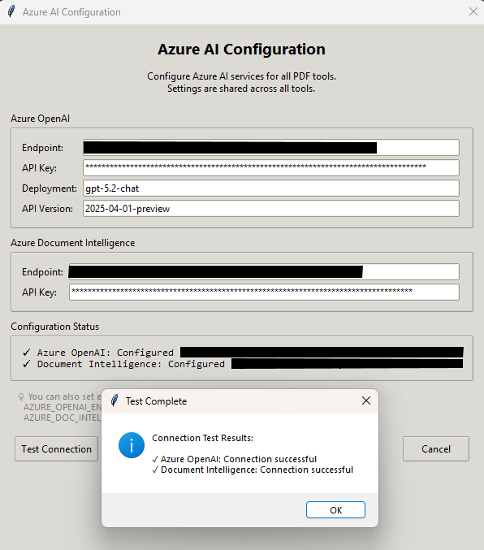

# Launcher GUI Documentation

The Launcher is a slim top-bar GUI that stays at the top of the screen, providing quick access to all PyPDF Toolbox utilities.

## Features

- **Slim Design**: Minimal screen footprint with a top-bar interface
- **Tool Discovery**: Automatically discovers available tools from `launch_pdf_*.bat` / `launch_pdf_*.sh` files
- **Tool Categorization**: Tools are automatically organized into categories (Split & Merge, Extract & Analyze, etc.) with visual separators
- **Window Positioning**: Positions tool windows in the available screen space below the launcher
- **Global Azure AI Configuration**: Centralized configuration for Azure OpenAI and Document Intelligence services
- **Process Management**: Properly terminates all tool subprocesses when exiting

## Screenshots

### Azure AI Configuration



*Azure AI Configuration dialog - Configure Azure OpenAI and Document Intelligence services globally for all tools*

### Main Launcher Window


*Main launcher bar showing available tools and control buttons*

## Usage

### Starting the Launcher

**Windows:**
```batch
launcher.bat
```

**Linux/macOS:**
```bash
./launcher.sh
```

### Silent Launch (No Console Window)

**Windows:**
- Double-click `PyPDF_Toolbox.pyw`
- Or use `start.bat`

### Launching Tools

Click on any tool button in the launcher bar to open that utility. The tool window will automatically position itself below the launcher.

**Tool Categories:**
- Tools are automatically organized into categories:
  - **Split & Merge**: Tools for splitting and combining PDFs
  - **Extract & Analyze**: Tools for extracting content from PDFs
  - **Convert & Transform**: Tools for converting and transforming PDFs
  - **Optimize**: Tools for compressing and optimizing PDFs
  - **Security**: Tools for encrypting/decrypting PDFs
  - **Annotate**: Tools for adding watermarks and annotations
- Visual separators appear between categories for easy navigation

### Azure AI Configuration

The launcher provides a global Azure AI configuration dialog accessible via the **"⚙️ Azure"** button in the launcher's control panel.

**To configure Azure AI services:**

1. Click the **"⚙️ Azure"** button in the launcher
2. Enter your Azure credentials:
   - **Azure OpenAI**: Endpoint, API key, deployment name, and API version
   - **Azure Document Intelligence**: Endpoint and API key
3. Click **"Test Connection"** to verify your settings
4. Click **"Save"** to store the configuration

**Configuration is shared across all tools** - once configured in the launcher, all PDF tools that use Azure AI will automatically use these settings.

**Alternative Configuration Methods:**

- **Environment Variables**: Set `AZURE_OPENAI_ENDPOINT`, `AZURE_OPENAI_API_KEY`, `AZURE_DOC_INTEL_ENDPOINT`, `AZURE_DOC_INTEL_API_KEY`
- **Config File**: Edit `config/azure_ai.yaml` directly (see `config/azure_ai.yaml.template` for format)

See the screenshot above for the configuration dialog interface.

## Technical Details

- **Source File**: `src/launcher_gui.py`
- **Framework**: tkinter with ttk widgets
- **Position**: Top of screen (fullwidth or centered)

## Environment Variables

The launcher sets these environment variables for child tools:

| Variable | Description |
|----------|-------------|
| `TOOL_WINDOW_X` | X position for tool window |
| `TOOL_WINDOW_Y` | Y position for tool window |
| `TOOL_WINDOW_WIDTH` | Available width for tool window |
| `TOOL_WINDOW_HEIGHT` | Available height for tool window |
