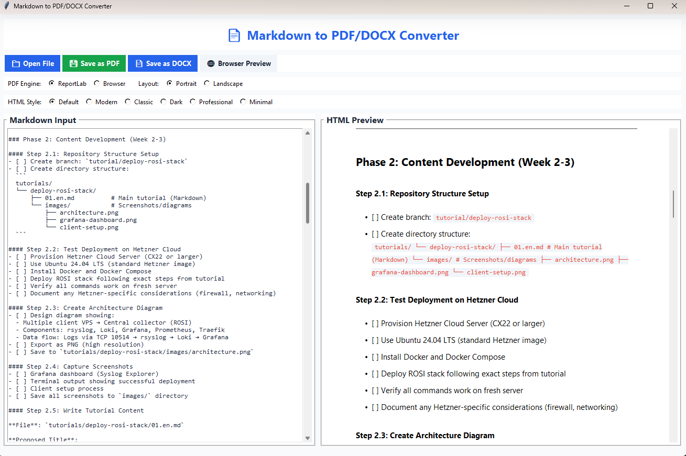

# Markdown to PDF/DOCX Converter Documentation

The Markdown to PDF/DOCX Converter allows you to convert Markdown files to professionally formatted PDF or Word documents with modern styling and formatting.

## Features

- **PDF Export**: Convert Markdown to PDF using ReportLab or Browser-based rendering
- **DOCX Export**: Export to Microsoft Word format (.docx)
- **Live Preview**: Preview the converted HTML in your browser
- **Drag and Drop**: Drop Markdown files directly into the application
- **Modern Styling**: Professional formatting with modern CSS
- **Gemini Citation Support**: Special formatting for Gemini AI citations
- **Multiple Layouts**: Portrait and landscape orientations for PDF
- **Code Highlighting**: Syntax highlighting for code blocks

## Screenshots



*Main interface with Markdown input on the left and HTML preview on the right, featuring HTML style presets, PDF/DOCX export options, and live preview*

| Screenshot | Description |
|------------|-------------|
| `01-main-window.png` | Main interface with input and preview |

## Usage

### Opening Files

1. **Drag and Drop**: Drag `.md` files onto the input area
2. **Open File**: Click "📁 Open File" to browse for Markdown files
3. **Paste Content**: Paste Markdown content directly into the input area

### Exporting to PDF

1. Click "💾 Save as PDF" button
2. Choose output location and filename
3. Select PDF engine:
   - **ReportLab**: Fast, reliable PDF generation (default)
   - **Browser**: Best emoji/icon support, uses Chromium/Edge
4. Choose layout:
   - **Portrait**: Standard vertical layout (default)
   - **Landscape**: Horizontal layout for wide content
5. Click "Save" to export

### Exporting to DOCX

1. Click "📄 Save as DOCX" button
2. Choose output location and filename
3. The document will be exported with proper formatting

### Browser Preview

1. Click "🌐 Browser Preview" to open the rendered HTML in your default browser
2. The preview updates automatically when you make changes
3. Use this for the best visual representation of your document

## Technical Details

- **Source File**: `src/pdf_md_converter.py`
- **Launch Script**: `launch_pdf_md_converter.bat` / `launch_pdf_md_converter.sh`
- **Framework**: tkinter with tkinterdnd2 for drag & drop
- **Markdown Processing**: python-markdown with extensions (codehilite, tables, toc, fenced_code)
- **PDF Generation**: ReportLab (primary) or Browser-based (Chromium/Edge)
- **DOCX Generation**: python-docx

## Dependencies

- `markdown` - Markdown parsing
- `reportlab` - PDF generation
- `python-docx` - DOCX export
- `tkinterdnd2` - Drag and drop support
- `html2text` - HTML to text conversion (optional)

## Supported Markdown Features

- Headers (H1-H6)
- Bold and italic text
- Code blocks with syntax highlighting
- Inline code
- Lists (ordered and unordered)
- Tables
- Blockquotes
- Links
- Horizontal rules
- Gemini citations: `[cite_start]text[cite: numbers]`

## Keyboard Shortcuts

| Shortcut | Action |
|----------|--------|
| `Ctrl+O` | Open file |
| `Ctrl+S` | Save (context-dependent) |
| `Ctrl+P` | Print preview (browser) |

## Troubleshooting

### PDF Export Fails

- Ensure ReportLab is installed: `pip install reportlab`
- For browser-based PDF, ensure Edge or Chrome is installed
- Check console output for detailed error messages

### DOCX Export Fails

- Ensure python-docx is installed: `pip install python-docx`
- Check file permissions for output directory

### Preview Not Updating

- Click "🌐 Browser Preview" again to refresh
- Ensure browser allows local file access

### Drag and Drop Not Working

- Ensure tkinterdnd2 is installed: `pip install tkinterdnd2`
- Try using "Open File" button as alternative

## Examples

### Basic Markdown

```markdown
# My Document

This is a **bold** and *italic* text example.

## Section 1

- Item 1
- Item 2
- Item 3
```

### With Code

```markdown
## Code Example

```python
def hello():
    print("Hello, World!")
```
```

### With Table

```markdown
| Feature | Status |
|---------|--------|
| PDF Export | ✅ |
| DOCX Export | ✅ |
```

### With Gemini Citations

```markdown
[cite_start]**Important Note:** This is a citation [cite: 1, 2, 3]
```
