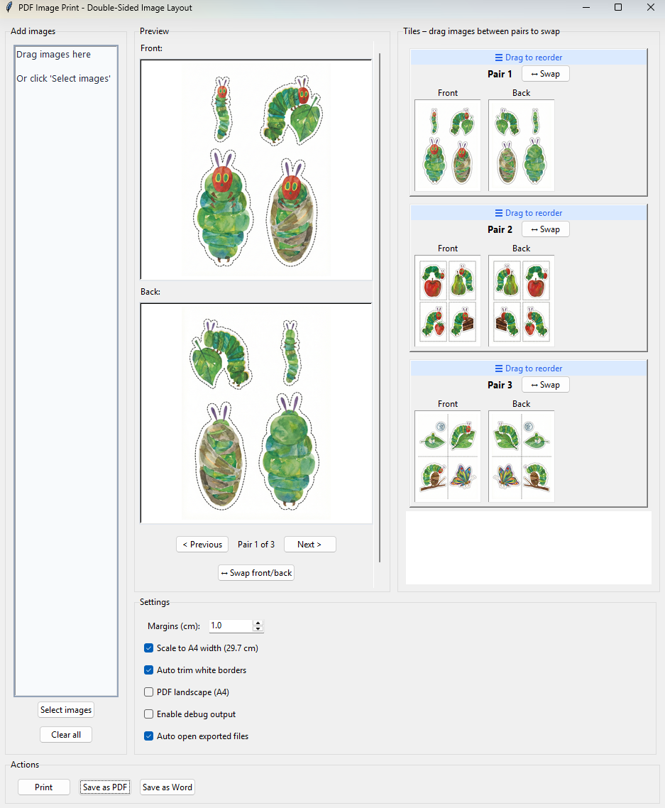

# PDF Image Print – User Guide

Prepare images for double-sided printing by arranging them in front/back pairs. Export to PDF or Word, or print directly. Ideal for creating duplex-printed cards, photo layouts, or booklet-style documents from image files.

## Getting Started

1. **Launch the tool** from the PyPDF Toolbox launcher (🖨️ PDF Image Print)
2. **Add images** by dragging files onto the drop area or clicking "Select images"
3. Images are paired automatically: 1st + 2nd = Pair 1, 3rd + 4th = Pair 2, and so on
4. **Export** via Print, Save as PDF, or Save as Word

## Features

- **Front/Back Pairs**: Arrange images for duplex (double-sided) printing
- **PDF Export**: Export to PDF with A4 sizing
- **Word Export**: Export to DOCX for further editing
- **Print**: Create a temporary PDF and open it for printing
- **Drag and Drop**: Add images by dragging files onto the app
- **Mirroring**: Right-click any image for mirror options (None, Horizontal, Vertical, Both)
- **Auto Trim**: Remove white/transparent borders before export
- **Scaling**: Scale images to A4 width while keeping aspect ratio
- **Reorder Pairs**: Drag the ☰ handle to change pair order
- **Swap Images**: Drag images between pairs or between Front/Back to fix wrong arrangements
- **Landscape**: Optional landscape A4 layout for PDF export

## Screenshots

*Main interface with drop zone, preview, tiles, and actions*

| Screenshot | Description |
|------------|-------------|
| `01-main-window.png` | Main interface with Add images, Preview, Tiles, Settings, and Actions |

## Interface Overview

| Area | Purpose |
|------|---------|
| **Add images** | Drop zone and file selection |
| **Preview** | Large view of the current pair’s front and back |
| **Tiles** | Thumbnail list of all pairs with reorder and swap controls |
| **Settings** | Margins, scaling, auto-trim, landscape, debug |
| **Actions** | Print, Save as PDF, Save as Word |

## Usage

### Adding Images

1. **Drag and Drop**: Drag image files (PNG, JPG, JPEG, GIF, BMP) onto the drop area
2. **Select Images**: Click "Select images" to browse for files
3. Images are paired in order: 1st+2nd = Pair 1, 3rd+4th = Pair 2, etc.
4. **Odd number**: The last image has an empty back side

### Correcting Arrangements

**Swap front and back within a pair:**
- Drag from the large Front preview onto the Back preview (or vice versa)
- Or use the **↔ Swap front/back** button for the current pair
- Or use the **↔ Swap** button on a pair’s tile

**Swap images between pairs:**
- Drag an image thumbnail from one pair’s Front or Back to another pair’s Front or Back

**Reorder pairs:**
- Drag the **☰ Drag to reorder** handle at the top of a pair up or down

**Mirror an image:**
- Right-click the image → choose None, Horizontal, Vertical, or Both

**Delete a pair:**
- Right-click the pair’s tile → **Delete pair**

### Navigating Pairs

- **< Previous** / **Next >** to move between pairs
- Click a pair’s tile to select it
- The main preview updates to show the selected pair’s front and back

### Settings

| Setting | Description |
|---------|-------------|
| **Margins (cm)** | Page margins (default: 1.0 cm) |
| **Scale to A4 width** | Fit images to 29.7 cm width while keeping aspect ratio |
| **Auto trim white borders** | Crop white/transparent edges before export |
| **PDF landscape (A4)** | Use landscape instead of portrait for PDF |
| **Auto open exported files** | Open PDF/DOCX in the default app after export |
| **Enable debug output** | Show debug log for troubleshooting |

### Export Actions

| Action | Behavior |
|--------|----------|
| **Print** | Creates a temporary PDF and opens it for printing |
| **Save as PDF** | Saves to a PDF file |
| **Save as Word** | Saves to a DOCX file |

A wait cursor appears during PDF and Word export.

## Supported Image Formats

- PNG  
- JPG / JPEG  
- GIF  
- BMP  

## Typical Workflow

1. Load images in the order you want them paired (e.g. front1, back1, front2, back2).
2. Check the Preview and Tiles; use drag-and-drop or swap to correct any mistakes.
3. Right-click images that need mirroring (e.g. back sides for duplex).
4. Adjust margins and scaling if needed.
5. Export with Print, Save as PDF, or Save as Word.

## Tips

- **Pairing order**: Add images in front-back order (front1, back1, front2, back2).
- **Wrong arrangement**: Use drag-and-swap instead of re-adding files.
- **Duplex printing**: Use mirroring on back images if required by your printer.
- **Large images**: May take a moment to load; the wait cursor shows during export.
- **Single-sided page**: The last image (odd count) has an empty back side.

## Troubleshooting

### Images Not Loading

- Use supported formats: PNG, JPG, JPEG, GIF, BMP.
- Check that the files are readable and not corrupted.

### PDF or Word Export Fails

- Install `reportlab` for PDF: `pip install reportlab`
- Install `python-docx` for Word: `pip install python-docx`
- Ensure the output folder exists and is writable
- Enable "Enable debug output" and check the log for details

### Print Opens Unexpected App

- The tool opens the generated PDF with your system default PDF viewer.
- Change the default app for `.pdf` files in your OS settings if needed.

## Technical Details

- **Source**: `src/pdf_image_print.py`
- **Launch scripts**: `launch_pdf_image_print.bat` / `launch_pdf_image_print.sh`

## Dependencies

- Pillow (PIL) – image loading and processing
- reportlab – PDF generation
- python-docx – Word export
- tkinterdnd2 – drag and drop support
